# ARCHITECTURE.md — Budget Management App (Backend Microservices)

> **Activity 1.2 — Formal Architectural & REST Compliance Audit**
> Date: 2026-02-23 | Branch: `refactor/change-files-S2`

---

## 0. Architectural Evolution: From Monolith to Microservices

The original "Brownfield monolith" was a single deployable unit that shared a unified database and exhibited tight coupling between its various modules. This structure, while simpler to deploy initially, presented significant challenges at scale.

In the context of this Budget Management App, the monolithic approach suffered from several concrete pain points:
1. **Coupled deployments:** Changing transaction validation logic required a full redeployment of the complex reporting logic.
2. **Resource contention:** Heavy report generation tasks consumed significant CPU and memory, impacting the responsiveness and availability of transaction creation APIs.
3. **Database locking:** High-concurrency transaction inserts could lock tables or rows, slowing down complex report aggregation queries sharing the same database.
4. **Synchronous latency:** Synchronously calculating reports or balances during a transaction creation process significantly increased the response time for users.
5. **Lack of fault tolerance:** A runtime failure (like an OutOfMemoryError) during report generation would crash the entire application, breaking the transaction ingestion capabilities as well.

The current **Event-driven microservices architecture** addresses these issues by:
- Separating deployments into two independent microservices (`transaction` and `report`), allowing independent iteration and release cycles.
- Isolating resources so heavy reporting compute doesn't steal CPU/RAM from the transaction ingest APIs.
- Splitting the database (database-per-service), removing database-level read/write locking conflicts entirely.
- Decoupling operations with asynchronous messaging (RabbitMQ), ensuring transaction APIs return `201 Created` immediately while reports recalculate in the background.
- Improving fault resilience; if the Report service goes down, the Transaction service continues accepting data, and events are queued safely in RabbitMQ until recovery.

**Theoretical Comparison with Clean Architecture (Ports & Adapters):**
If we applied Clean Architecture to the current services, the core domain logic would be entirely isolated from infrastructure concerns (e.g., Spring Web, Spring Data JPA, RabbitMQ). The controllers, repositories, and message publishers/consumers would become external adapters implementing domain-defined interfaces (ports). Currently, the services use a classic layered approach where the domain directly depends on infrastructure artifacts (e.g., JPA entities, Spring annotations). Clean Architecture would enforce the Dependency Rule (dependencies point inwards), making the services framework-agnostic and easier to unit-test at the core domain level, albeit introducing more mapping overhead between entities and domain models.

---

## 1. Architectural Decisions

### 1.1 Architecture Style

The backend adopts an **Event-Driven Microservices** architecture with a **Layered** internal structure per service.

| Concern | Decision |
|---|---|
| Decomposition | Two independent microservices: `transaction` (port 8081) and `report` (port 8082) |
| Internal layering | Controller → Service → Repository (classic Spring three-layer) |
| Inter-service communication | Asynchronous messaging via RabbitMQ (Topic Exchange) |
| Database strategy | Database-per-service (polyglot persistence): `transactions_db` and `reports_db` (both MySQL 8.0) |
| API style | RESTful JSON over HTTP |
| Authentication boundary | Delegated to Firebase (frontend); backend receives `userId` as a path/body parameter |
| Containerization | Docker multi-stage builds orchestrated by a root `docker-compose.yml` |

### 1.2 Justification

- **Microservice decomposition** isolates the write-heavy transactional domain from the read-heavy reporting domain, allowing independent scaling and deployment.
- **Event-driven communication** decouples the services temporally — the Transaction service does not need to wait for report calculations to complete before responding to the client.
- **Database-per-service** enforces bounded context data ownership, preventing shared-state coupling.

### 1.3 Trade-offs

| Advantage | Trade-off |
|---|---|
| Independent deployability | Operational complexity (two JVMs, two databases, one message broker) |
| Loose coupling via events | Eventual consistency — reports may lag behind transactions |
| Separate scaling | Data duplication across databases |
| Technology freedom per service | Increased infrastructure cost (Docker, RabbitMQ, multiple MySQL instances) |

### 1.4 Scalability Considerations

- Horizontal scaling of the Transaction service is straightforward; stateless HTTP handlers can be replicated behind a load balancer.
- The Report service can scale consumers by increasing RabbitMQ consumer concurrency (`spring.rabbitmq.listener.simple.concurrency`).
- **Current limitation**: no idempotency key mechanism exists on the message consumer. Duplicate messages will double-count amounts (documented as DT-DOC-02).
- Pagination is capped at 100 items per page via `PaginationUtils`, preventing unbounded result sets.

---

## 2. REST Compliance Analysis

### 2.1 HTTP Semantics Validation

| Endpoint | Verb | Correct? | Notes |
|---|---|---|---|
| `POST /api/v1/transactions` | POST | **Yes** | Creates a new resource; non-idempotent by nature |
| `GET /api/v1/transactions/{id}` | GET | **Yes** | Safe, idempotent read of a single resource |
| `GET /api/v1/transactions` | GET | **Yes** | Safe, idempotent collection read with pagination |
| `GET /api/v1/reports/{userId}` | GET | **Yes** | Safe read filtered by user and optional period |
| `GET /api/v1/reports/{userId}/all` | GET | **Yes** | Paginated collection read |
| `GET /api/v1/reports/{userId}/summary` | GET | **Yes** | Computed aggregate — safe, idempotent |
| `GET /api/v1/reports/{userId}/pdf` | GET | **Yes** | Binary download; safe, idempotent |
| `POST /api/v1/reports/recalculate` | POST | **Issue** | See finding F-01 below |
| `DELETE /api/v1/reports/{reportId}` | DELETE | **Yes** | Idempotent removal by numeric ID |
| `DELETE /api/v1/reports/{period}` | DELETE | **Yes** | Idempotent removal by period string |

### 2.2 Idempotency Discussion

| Verb | Expected idempotency | Actual behavior | Status |
|---|---|---|---|
| GET | Idempotent | All GET handlers return consistent reads | Compliant |
| POST (transaction) | Non-idempotent | Each call creates a new row | Compliant |
| POST (recalculate) | Non-idempotent | Each call saves (even without changes) | Acceptable |
| DELETE | Idempotent | Throws `ReportNotFoundException` on second call | **Non-compliant** (F-02) |

### 2.3 Status Code Strategy

| Scenario | Code used | Expected | Verdict |
|---|---|---|---|
| Transaction created | `201 CREATED` | 201 | Correct |
| Resource retrieved | `200 OK` | 200 | Correct |
| Report recalculated | `200 OK` | 200 | Correct |
| Report deleted | `204 NO_CONTENT` | 204 | Correct |
| Resource not found | `404 NOT_FOUND` | 404 | Correct |
| Validation failure | `400 BAD_REQUEST` | 400 | Correct |
| Unhandled exception | `500 INTERNAL_SERVER_ERROR` | 500 | Correct |
| Report created via POST | — | `201 CREATED` | **Missing** (F-01) |

### 2.4 Error Response Standardization

**Finding F-03**: The two microservices use **different error response schemas**.

Transaction service:
```json
{
  "dateTime": "2026-02-23T10:15:30",
  "message": "Transaction not found",
  "path": "/api/v1/transactions/999"
}
```

Report service:
```json
{
  "timestamp": "2026-02-23T10:15:30",
  "message": "Report not found for user 'abc' and period '2025-01'",
  "status": 404
}
```

- Field naming diverges (`dateTime` vs `timestamp`).
- Transaction includes `path`; Report includes `status`.
- Neither includes an error `code` for programmatic error discrimination.

---

## 3. API Contract Documentation

### 3.1 Transaction Microservice (port 8081)

---

#### POST /api/v1/transactions

**Description:** Creates a new financial transaction and asynchronously publishes a domain event to RabbitMQ.

**Headers:**
| Header | Value |
|---|---|
| Content-Type | `application/json` |

**Request Body:**
```json
{
  "userId": "firebase-uid-abc123",
  "type": "EXPENSE",
  "amount": 150.75,
  "category": "Food",
  "date": "2026-02-20",
  "description": "Weekly groceries"
}
```

| Field | Type | Constraints |
|---|---|---|
| `userId` | String | Required, not blank |
| `type` | Enum | Required. Values: `INCOME`, `EXPENSE` |
| `amount` | BigDecimal | Required, positive, max 19 integer + 2 decimal digits |
| `category` | String | Required, not blank, max 100 characters |
| `date` | LocalDate (ISO) | Required |
| `description` | String | Optional, max 500 characters |

**Success Response:** `201 CREATED`
```json
{
  "transactionId": 1,
  "userId": "firebase-uid-abc123",
  "type": "EXPENSE",
  "amount": 150.75,
  "category": "Food",
  "date": "2026-02-20",
  "description": "Weekly groceries",
  "createdAt": "2026-02-20T14:30:00Z"
}
```

**Error Responses:**

`400 BAD REQUEST` — Validation failure
```json
{
  "dateTime": "2026-02-23T10:15:30",
  "message": "amount: Amount must be positive; category: Category is required",
  "path": "/api/v1/transactions"
}
```

`500 INTERNAL SERVER ERROR` — Unexpected failure
```json
{
  "dateTime": "2026-02-23T10:15:30",
  "message": "An unexpected error occurred",
  "path": "/api/v1/transactions"
}
```

---

#### GET /api/v1/transactions/{id}

**Description:** Retrieves a single transaction by its database identifier.

**Path Parameters:**
| Parameter | Type | Description |
|---|---|---|
| `id` | Long | Transaction primary key |

**Success Response:** `200 OK`
```json
{
  "transactionId": 1,
  "userId": "firebase-uid-abc123",
  "type": "EXPENSE",
  "amount": 150.75,
  "category": "Food",
  "date": "2026-02-20",
  "description": "Weekly groceries",
  "createdAt": "2026-02-20T14:30:00Z"
}
```

**Error Responses:**

`404 NOT FOUND`
```json
{
  "dateTime": "2026-02-23T10:15:30",
  "message": "Transaction not found",
  "path": "/api/v1/transactions/999"
}
```

---

#### GET /api/v1/transactions

**Description:** Retrieves a paginated list of all transactions, sorted by date descending by default.

**Query Parameters:**
| Parameter | Type | Default | Description |
|---|---|---|---|
| `page` | int | `0` | Zero-indexed page number |
| `size` | int | `10` | Items per page (max 100) |
| `sort` | String | `date,desc` | Sort field and direction |

**Success Response:** `200 OK`
```json
{
  "content": [
    {
      "transactionId": 2,
      "userId": "firebase-uid-abc123",
      "type": "INCOME",
      "amount": 3000.00,
      "category": "Salary",
      "date": "2026-02-15",
      "description": "Monthly salary",
      "createdAt": "2026-02-15T09:00:00Z"
    }
  ],
  "page": 0,
  "size": 10,
  "totalElements": 1,
  "totalPages": 1,
  "last": true
}
```

---

### 3.2 Report Microservice (port 8082)

---

#### GET /api/v1/reports/{userId}

**Description:** Retrieves the financial report for a specific user and period.

**Path Parameters:**
| Parameter | Type | Description |
|---|---|---|
| `userId` | String | Firebase user identifier |

**Query Parameters:**
| Parameter | Type | Required | Validation | Description |
|---|---|---|---|---|
| `period` | String | No | `yyyy-MM` format (custom `@ValidPeriod`) | Monthly period filter |

**Success Response:** `200 OK`
```json
{
  "reportId": 1,
  "userId": "firebase-uid-abc123",
  "period": "2026-02",
  "totalIncome": 3000.00,
  "totalExpense": 150.75,
  "balance": 2849.25,
  "createdAt": "2026-02-15T09:00:00Z",
  "updatedAt": "2026-02-20T14:30:00Z"
}
```

**Error Responses:**

`400 BAD REQUEST` — Invalid period format
```json
{
  "timestamp": "2026-02-23T10:15:30",
  "message": "Period must be in YYYY-MM format",
  "status": 400
}
```

`404 NOT FOUND` — No report exists
```json
{
  "timestamp": "2026-02-23T10:15:30",
  "message": "Report not found for user 'firebase-uid-abc123' and period '2026-02'",
  "status": 404
}
```

---

#### GET /api/v1/reports/{userId}/all

**Description:** Retrieves all reports for a user with pagination, sorted by period descending.

**Path Parameters:**
| Parameter | Type | Description |
|---|---|---|
| `userId` | String | Firebase user identifier |

**Query Parameters:**
| Parameter | Type | Default | Description |
|---|---|---|---|
| `page` | int | `0` | Zero-indexed page number |
| `size` | int | `10` | Items per page (max 100) |
| `sort` | String | `period,desc` | Sort field and direction |

**Success Response:** `200 OK`
```json
{
  "content": [
    {
      "reportId": 1,
      "userId": "firebase-uid-abc123",
      "period": "2026-02",
      "totalIncome": 3000.00,
      "totalExpense": 150.75,
      "balance": 2849.25,
      "createdAt": "2026-02-15T09:00:00Z",
      "updatedAt": "2026-02-20T14:30:00Z"
    }
  ],
  "page": 0,
  "size": 10,
  "totalElements": 1,
  "totalPages": 1,
  "last": true
}
```

---

#### GET /api/v1/reports/{userId}/summary

**Description:** Computes an aggregate financial summary across a range of monthly periods.

**Path Parameters:**
| Parameter | Type | Description |
|---|---|---|
| `userId` | String | Firebase user identifier |

**Query Parameters:**
| Parameter | Type | Required | Validation | Description |
|---|---|---|---|---|
| `startPeriod` | String | Yes | `yyyy-MM` format | Start of range (inclusive) |
| `endPeriod` | String | Yes | `yyyy-MM` format | End of range (inclusive) |

**Success Response:** `200 OK`
```json
{
  "userId": "firebase-uid-abc123",
  "startPeriod": "2026-01",
  "endPeriod": "2026-02",
  "reports": [
    {
      "reportId": 1,
      "userId": "firebase-uid-abc123",
      "period": "2026-01",
      "totalIncome": 2800.00,
      "totalExpense": 1200.00,
      "balance": 1600.00,
      "createdAt": "2026-01-31T23:59:00Z",
      "updatedAt": "2026-01-31T23:59:00Z"
    },
    {
      "reportId": 2,
      "userId": "firebase-uid-abc123",
      "period": "2026-02",
      "totalIncome": 3000.00,
      "totalExpense": 150.75,
      "balance": 2849.25,
      "createdAt": "2026-02-15T09:00:00Z",
      "updatedAt": "2026-02-20T14:30:00Z"
    }
  ],
  "totalIncome": 5800.00,
  "totalExpense": 1350.75,
  "balance": 4449.25
}
```

**Error Responses:**

`400 BAD REQUEST` — Invalid period format
```json
{
  "timestamp": "2026-02-23T10:15:30",
  "message": "Period must be in YYYY-MM format",
  "status": 400
}
```

---

#### GET /api/v1/reports/{userId}/pdf

**Description:** Generates and downloads a PDF financial report for a given user and period.

**Path Parameters:**
| Parameter | Type | Description |
|---|---|---|
| `userId` | String | Firebase user identifier |

**Query Parameters:**
| Parameter | Type | Required | Validation | Description |
|---|---|---|---|---|
| `period` | String | Yes | `yyyy-MM` format | Monthly period |

**Success Response:** `200 OK`
| Header | Value |
|---|---|
| Content-Type | `application/pdf` |
| Content-Disposition | `attachment; filename="reporte-2026-02.pdf"` |
| Content-Length | `{byte length}` |

Body: Binary PDF content.

**Error Responses:**

`404 NOT FOUND` — No report exists for the user/period
```json
{
  "timestamp": "2026-02-23T10:15:30",
  "message": "Report not found for user 'firebase-uid-abc123' and period '2026-02'",
  "status": 404
}
```

`500 INTERNAL SERVER ERROR` — PDF generation failure
```json
{
  "timestamp": "2026-02-23T10:15:30",
  "message": "No fue posible generar el PDF. Inténtalo de nuevo más tarde.",
  "status": 500
}
```

---

#### POST /api/v1/reports/recalculate

**Description:** Triggers recalculation of a report for a specific user and period.

**Headers:**
| Header | Value |
|---|---|
| Content-Type | `application/json` |

**Request Body:**
```json
{
  "userId": "firebase-uid-abc123",
  "period": "2026-02"
}
```

| Field | Type | Constraints |
|---|---|---|
| `userId` | String | Required, not blank |
| `period` | String | Required, not blank, `yyyy-MM` format |

**Success Response:** `200 OK`
```json
{
  "reportId": 1,
  "userId": "firebase-uid-abc123",
  "period": "2026-02",
  "totalIncome": 3000.00,
  "totalExpense": 150.75,
  "balance": 2849.25,
  "createdAt": "2026-02-15T09:00:00Z",
  "updatedAt": "2026-02-23T10:20:00Z"
}
```

**Error Responses:**

`400 BAD REQUEST` — Validation failure
```json
{
  "timestamp": "2026-02-23T10:15:30",
  "message": "userId: userId cannot be blank; period: period must be in format yyyy-MM",
  "status": 400
}
```

`404 NOT FOUND` — Report does not exist
```json
{
  "timestamp": "2026-02-23T10:15:30",
  "message": "Report not found for user 'firebase-uid-abc123' and period '2026-02'",
  "status": 404
}
```

---

#### DELETE /api/v1/reports/{reportId}

**Description:** Deletes a report by its numeric database ID. Requires authentication (injects `Principal`).

**Path Parameters:**
| Parameter | Type | Constraint | Description |
|---|---|---|---|
| `reportId` | Long | Regex `[0-9]+` | Report primary key |

**Success Response:** `204 NO CONTENT`

No body.

**Error Responses:**

`400 BAD REQUEST` — Invalid report ID
```json
{
  "timestamp": "2026-02-23T10:15:30",
  "message": "Report ID must be greater than 0",
  "status": 400
}
```

`404 NOT FOUND` — Report does not exist or ownership mismatch
```json
{
  "timestamp": "2026-02-23T10:15:30",
  "message": "Report not found for user 'firebase-uid-abc123' and period 'N/A'",
  "status": 404
}
```

---

#### DELETE /api/v1/reports/{period}

**Description:** Deletes a report by its period string. Requires authentication (injects `Principal`).

**Path Parameters:**
| Parameter | Type | Constraint | Description |
|---|---|---|---|
| `period` | String | Regex `[0-9]{4}-[0-9]{2}` | Monthly period in `yyyy-MM` format |

**Success Response:** `204 NO CONTENT`

No body.

**Error Responses:**

`404 NOT FOUND` — Report does not exist
```json
{
  "timestamp": "2026-02-23T10:15:30",
  "message": "Report not found for user 'firebase-uid-abc123' and period '2026-02'",
  "status": 404
}
```

---

## 4. Error Handling Strategy

### 4.1 Global Exception Handling

Both microservices use `@RestControllerAdvice` for centralized exception handling.

**Transaction Service — `GlobalExceptionHandler`:**

| Exception | HTTP Status | Response fields |
|---|---|---|
| `EntityNotFoundException` | `404 NOT_FOUND` | `dateTime`, `message`, `path` |
| `Exception` (catch-all) | `500 INTERNAL_SERVER_ERROR` | `dateTime`, `message`, `path` |

**Report Service — `GlobalExceptionHandler`:**

| Exception | HTTP Status | Response fields |
|---|---|---|
| `ReportNotFoundException` | `404 NOT_FOUND` | `timestamp`, `message`, `status` |
| `ConstraintViolationException` | `400 BAD_REQUEST` | `timestamp`, `message`, `status` |
| `MethodArgumentNotValidException` | `400 BAD_REQUEST` | `timestamp`, `message`, `status` |
| `IllegalArgumentException` | `400 BAD_REQUEST` | `timestamp`, `message`, `status` |

### 4.2 Validation Strategy

| Layer | Mechanism |
|---|---|
| Controller entry | Jakarta Bean Validation via `@Valid` / `@Validated` |
| Custom constraint | `@ValidPeriod` annotation with `PeriodValidator` (regex `^\d{4}-(0[1-9]\|1[0-2])$`) |
| Service layer | Manual null/blank checks with `IllegalArgumentException` |
| Entity layer | JPA `@Column(nullable = false)` constraints, `@PrePersist` lifecycle callbacks |

### 4.3 Standard Error Response Formats

**Transaction Service — `CustomErrorResponse`:**
```json
{
  "dateTime": "2026-02-23T10:15:30",
  "message": "Transaction not found",
  "path": "/api/v1/transactions/999"
}
```

**Report Service — `ErrorResponse`:**
```json
{
  "timestamp": "2026-02-23T10:15:30",
  "message": "Report not found for user 'abc' and period '2026-01'",
  "status": 404
}
```

---

## 5. Security Considerations

### 5.1 Authentication & Authorization

| Aspect | Current state | Risk level |
|---|---|---|
| Authentication | Delegated to Firebase on the frontend; no token verification on the backend | **High** |
| Authorization | `userId` passed as path/body parameter; not validated against authenticated identity | **High** |
| DELETE endpoints | Accept `Principal` parameter but no Spring Security is configured to populate it | **Medium** |

**Impact**: Any client can read, create, or delete resources for any `userId` by sending arbitrary values. The `Principal` injection in DELETE endpoints will be `null` at runtime without Spring Security.

### 5.2 CORS Configuration

| Service | Allowed origins | Allowed methods |
|---|---|---|
| Transaction | `localhost:3000`, `localhost:4200` | GET, POST, OPTIONS |
| Report | `localhost:3000`, `localhost:4200` | GET, POST, PUT, DELETE, OPTIONS |

The Transaction service restricts CORS methods to GET/POST/OPTIONS, which is consistent with its endpoint surface. The Report service correctly includes DELETE.

### 5.3 Database Credentials

- Credentials are externalized via environment variables (`${DB_USERNAME}`, `${DB_PASSWORD}`).
- RabbitMQ defaults to `guest/guest` in `application.yaml` (overridden by Docker env vars in production).
- `spring.jpa.hibernate.ddl-auto: update` is used — acceptable for development but should be set to `validate` or `none` in production.

### 5.4 Input Validation Gaps

| Gap | Location | Risk |
|---|---|---|
| No `userId` format validation | Transaction `POST` | Accepts any string, including empty after trimming |
| No `Location` header on `201` | Transaction `POST` | Minor REST compliance gap |
| Pagination `size` not validated at controller level | Both services | Mitigated by `PaginationUtils.ensureSafePageSize()`, though this utility is declared but not invoked in the Transaction service |

---

## 6. Identified Improvements

### Findings Summary

| ID | Severity | Category | Description |
|---|---|---|---|
| F-01 | Medium | REST semantics | `POST /recalculate` returns `200 OK`; if the operation conceptually creates a new calculation state, it should return `201 CREATED`. However, since it operates on an existing resource, returning `200` is defensible if the semantics are "update in place." **Recommendation**: Clarify intent. If idempotent recalculation, consider `PUT`. |
| F-02 | Medium | Idempotency | `DELETE` endpoints throw `404` on second invocation. Per RFC 9110 §9.3.5, DELETE should be idempotent — a second DELETE on the same resource should return `204` or `404` consistently. **Recommendation**: Return `204` even if the resource is already gone. |
| F-03 | High | Consistency | Error response schemas differ across microservices (`dateTime`/`path` vs `timestamp`/`status`). **Recommendation**: Adopt a single, shared error contract across all services. |
| F-04 | High | Security | No server-side authentication or authorization. Any client can impersonate any user. **Recommendation**: Implement Firebase token verification via a Spring Security filter or a `HandlerInterceptor`. |
| F-05 | Medium | REST completeness | Transaction service lacks `PUT /api/v1/transactions/{id}` and `DELETE /api/v1/transactions/{id}` endpoints. The CORS config only allows GET/POST/OPTIONS, confirming these operations are not implemented. **Recommendation**: Implement update and delete operations. |
| F-06 | Low | REST naming | `GET /api/v1/reports/{userId}/all` uses `/all` as a sub-resource name. Since `GET /api/v1/reports/{userId}` already exists as a single-report lookup (filtered by `period` query param), the `/all` suffix breaks resource naming uniformity. **Recommendation**: Merge into a single `GET /api/v1/reports/{userId}` endpoint that returns a collection when no `period` is specified, or rename to `GET /api/v1/reports?userId={userId}`. |
| F-07 | Low | Robustness | `recalculateReport()` in `ReportServiceImpl` saves the report without actually recalculating values from the transaction stream. It is a no-op save. **Recommendation**: Implement actual recalculation logic by querying the transaction service or maintaining a local event log. |
| F-08 | Medium | Data integrity | `TransactionServiceImpl.create()` lacks `@Transactional` annotation. If the `save()` succeeds but the event publication fails, the transaction will be persisted without generating the corresponding report update. **Recommendation**: Add `@Transactional` and handle event publication failure gracefully. |
| F-09 | Medium | Messaging | `ReportConsumer` has no idempotency mechanism. If RabbitMQ redelivers a message (retry), the amount is accumulated again, leading to incorrect totals. **Recommendation**: Implement idempotent message processing using a `processedMessageIds` set or an idempotency key on the `TransactionMessage`. |
| F-10 | Low | Naming | `TransactionMapper.toRequest()` converts a DTO *to* an entity, but the method name suggests the opposite direction. **Recommendation**: Rename to `toEntity()`. |
| F-11 | Low | Error messages | `EntityNotFoundException` in the Transaction service returns a generic `"Transaction not found"` message without the requested ID. **Recommendation**: Include the ID in the message (e.g., `"Transaction not found with id: 999"`). |
| F-12 | Low | Architecture | `ReportService` interface imports `TransactionMessage` (an infrastructure DTO). This creates a dependency from the domain layer to the infrastructure layer, violating the Dependency Inversion Principle. **Recommendation**: Define a domain-level port/event and map `TransactionMessage` to it in the consumer. |
| F-13 | Low | Validation | `POST /api/v1/transactions` does not handle `MethodArgumentNotValidException` or `ConstraintViolationException` explicitly in its `GlobalExceptionHandler`. Validation errors fall through to the generic `Exception` handler, returning `500` instead of `400`. **Recommendation**: Add explicit handlers for validation exceptions in the Transaction service's `GlobalExceptionHandler`. |

### Priority Roadmap

**Immediate (Sprint 0):**
1. F-13 — Fix validation error handling in Transaction service (returns 500 instead of 400)
2. F-03 — Unify error response schema across services
3. F-08 — Add `@Transactional` to `TransactionServiceImpl.create()`

**Short-term (Sprint 1):**
4. F-04 — Implement Firebase token verification
5. F-09 — Add idempotent message processing
6. F-05 — Implement PUT and DELETE for transactions

**Medium-term (Sprint 2):**
7. F-02 — Make DELETE idempotent (return 204 on already-deleted)
8. F-07 — Implement actual recalculation logic
9. F-06 — Normalize resource naming
10. F-12 — Decouple service interface from infrastructure DTO

---

## 7. Postman Validation Evidence


### 7.1 F-13 — Validation errors return 500 instead of 400

#### Test F-13.1 — POST con body vacio `{}`

| Campo | Valor |
|---|---|
| **Method** | `POST` |
| **URL** | `http://localhost:8081/api/v1/transactions` |
| **Body** | `{}` |
| **Status esperado** | `400 BAD REQUEST` |
| **Status actual** | `500 INTERNAL SERVER ERROR` |

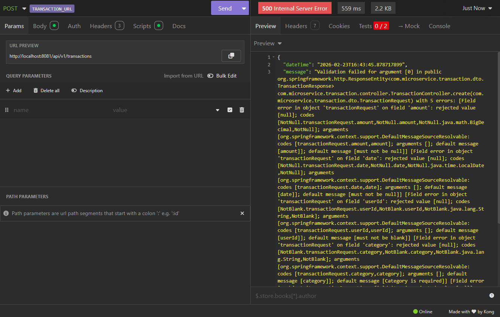

#### Test F-13.2 — POST con amount negativo

| Campo | Valor |
|---|---|
| **Method** | `POST` |
| **URL** | `http://localhost:8081/api/v1/transactions` |
| **Body** | `{"userId":"test","type":"EXPENSE","amount":-50,"category":"Food","date":"2026-02-20"}` |
| **Status esperado** | `400 BAD REQUEST` |
| **Status actual** | `500 INTERNAL SERVER ERROR` |
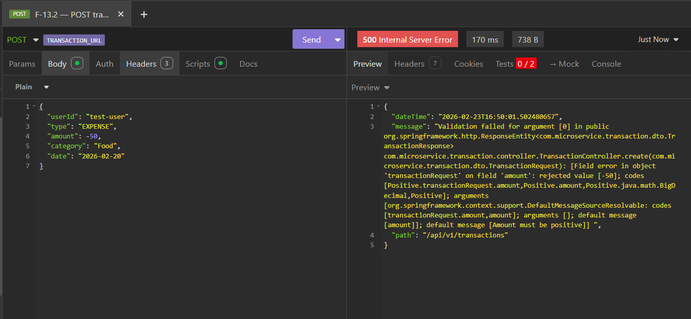

#### Test F-13.3 — POST con campos null

| Campo | Valor |
|---|---|
| **Method** | `POST` |
| **URL** | `http://localhost:8081/api/v1/transactions` |
| **Body** | `{"userId":"","type":null,"amount":null,"category":"","date":null}` |
| **Status esperado** | `400 BAD REQUEST` |
| **Status actual** | `500 INTERNAL SERVER ERROR` |

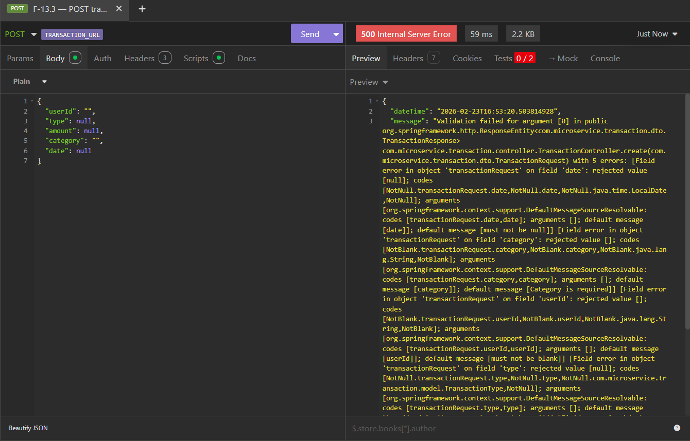

---

### 7.2 F-04 — No server-side authentication

#### Test F-04.1 — GET todas las transacciones sin autenticacion

| Campo | Valor |
|---|---|
| **Method** | `GET` |
| **URL** | `http://localhost:8081/api/v1/transactions` |
| **Headers** | Ninguno (sin Authorization) |
| **Status esperado** | `401 UNAUTHORIZED` |
| **Status actual** | `200 OK` — devuelve datos de todos los usuarios |


#### Test F-04.2 — POST con userId falso (suplantacion)

| Campo | Valor |
|---|---|
| **Method** | `POST` |
| **URL** | `http://localhost:8081/api/v1/transactions` |
| **Body** | `{"userId":"IMPERSONATED-USER-FAKE-ID","type":"INCOME","amount":999999.99,"category":"Hack","date":"2026-02-23"}` |
| **Status esperado** | `401 UNAUTHORIZED` o `403 FORBIDDEN` |
| **Status actual** | `201 CREATED` — acepta cualquier userId |

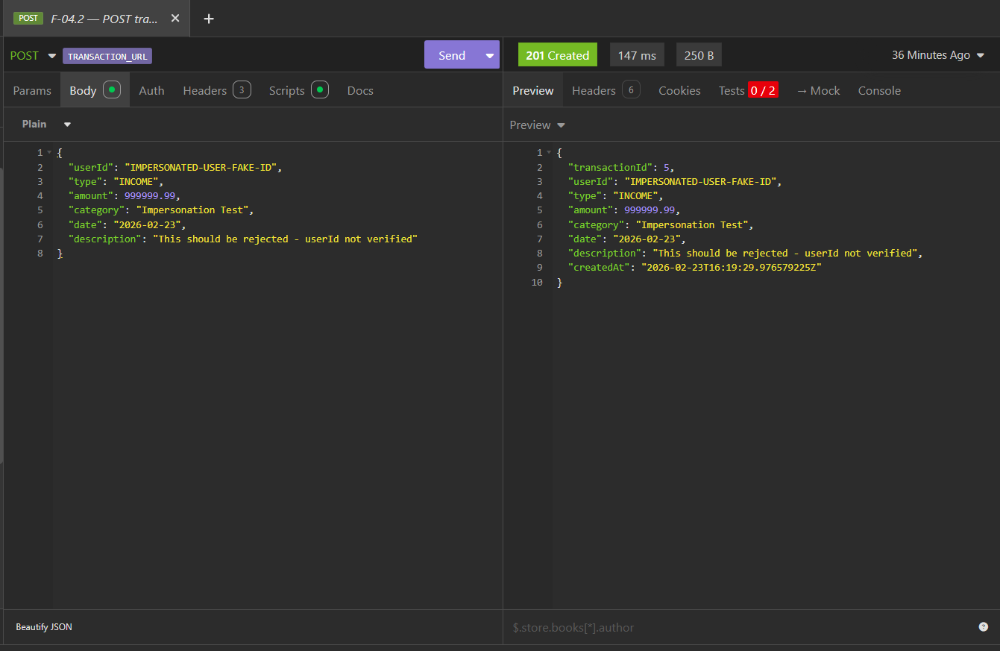

#### Test F-04.3 — GET reportes financieros de otro usuario

| Campo | Valor |
|---|---|
| **Method** | `GET` |
| **URL** | `http://localhost:8082/api/v1/reports/VICTIM-USER-ID/all` |
| **Headers** | Ninguno (sin Authorization) |
| **Status esperado** | `401 UNAUTHORIZED` |
| **Status actual** | `200 OK` — reportes financieros expuestos |

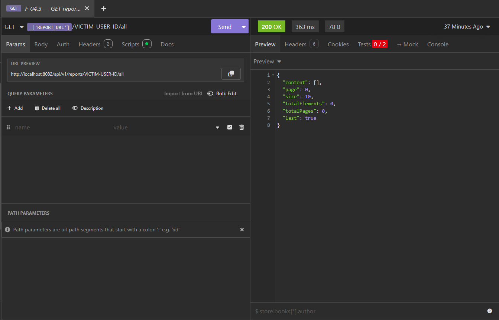

---

### 7.3 F-03 — Inconsistent error schemas between microservices

> **Nota:** Ambos servicios responden correctamente con `404 NOT FOUND`. El problema
> no es el status code sino que **el JSON de error tiene campos diferentes** en cada
> microservicio, lo que obliga al frontend a implementar dos parsers distintos para
> manejar errores.

#### Test F-03.1 — Error 404 del Transaction service

| Campo | Valor |
|---|---|
| **Method** | `GET` |
| **URL** | `http://localhost:8081/api/v1/transactions/99999` |
| **Status** | `404 NOT FOUND` |
| **Campos en response** | `dateTime`, `message`, `path` |

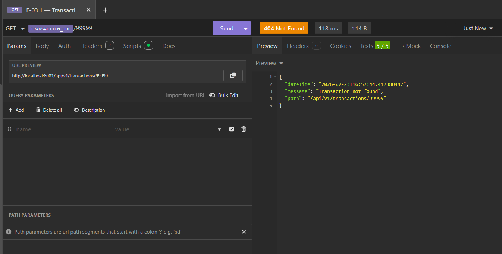

#### Test F-03.2 — Error 404 del Report service

| Campo | Valor |
|---|---|
| **Method** | `GET` |
| **URL** | `http://localhost:8082/api/v1/reports/nonexistent?period=2026-01` |
| **Status** | `404 NOT FOUND` |
| **Campos en response** | `timestamp`, `message`, `status` |

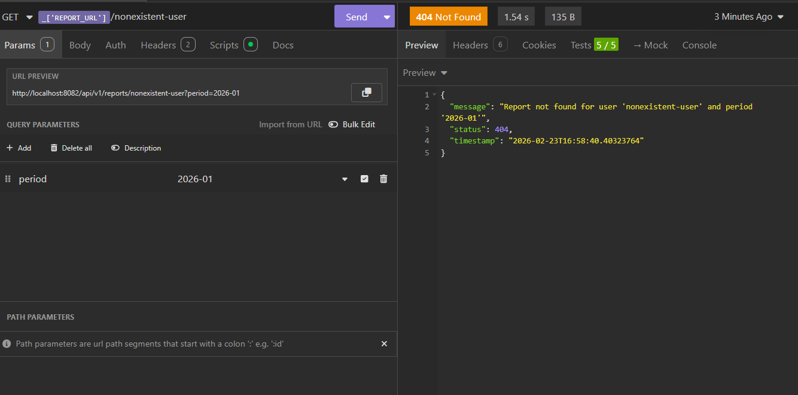

#### Comparativa de esquemas

| Campo | Transaction Service | Report Service |
|---|---|---|
| Timestamp | `dateTime` | `timestamp` |
| Mensaje | `message` | `message` |
| Contexto | `path` (ruta del endpoint) | `status` (codigo HTTP) |

> **Hallazgo:** Ambos servicios devuelven 404 correctamente, pero con **esquemas JSON
> distintos**. Transaction usa `dateTime` + `path`, Report usa `timestamp` + `status`.
> Esto no es un bug funcional sino una **violacion del principio de consistencia** en
> el contrato de la API — el frontend debe conocer qué microservicio origino el error
> para poder parsearlo correctamente.

---

### 7.4 F-02 — DELETE not idempotent

#### Test F-02.1 — Obtener reportId valido

| Campo | Valor |
|---|---|
| **Method** | `GET` |
| **URL** | `http://localhost:8082/api/v1/reports/{userId}/all` |
| **Proposito** | Obtener un `reportId` para las pruebas de DELETE |
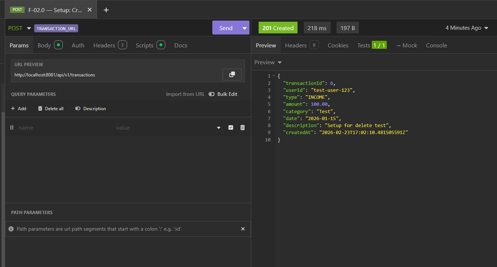


#### Test F-02.2 — Primer DELETE (exitoso)

| Campo | Valor |
|---|---|
| **Method** | `DELETE` |
| **URL** | `http://localhost:8082/api/v1/reports/{reportId}` |
| **Status esperado** | `204 NO CONTENT` |
| **Status actual** | `204 NO CONTENT` |

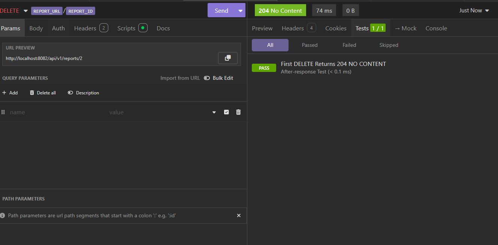

#### Test F-02.3 — Segundo DELETE (mismo ID — deberia ser idempotente)

| Campo | Valor |
|---|---|
| **Method** | `DELETE` |
| **URL** | `http://localhost:8082/api/v1/reports/{reportId}` (mismo ID) |
| **Status esperado** | `204 NO CONTENT` (idempotente per RFC 9110) |
| **Status actual** | `404 NOT FOUND` |

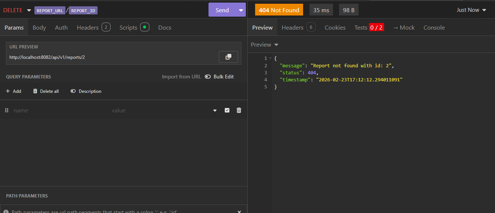

---

### 7.5 F-05 — Missing PUT and DELETE on Transaction service

#### Test F-05.1 — PUT transaction (no implementado)

| Campo | Valor |
|---|---|
| **Method** | `PUT` |
| **URL** | `http://localhost:8081/api/v1/transactions/1` |
| **Body** | `{"userId":"test","type":"EXPENSE","amount":200,"category":"Updated","date":"2026-02-20"}` |
| **Status actual** | `405 METHOD NOT ALLOWED` |

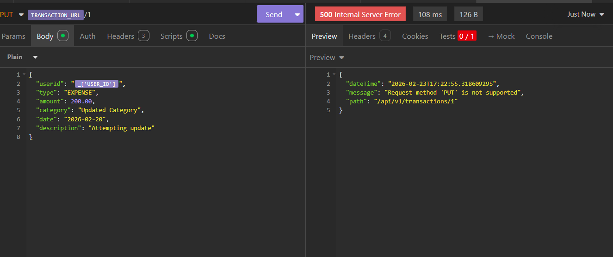

#### Test F-05.2 — DELETE transaction (no implementado)

| Campo | Valor |
|---|---|
| **Method** | `DELETE` |
| **URL** | `http://localhost:8081/api/v1/transactions/1` |
| **Status actual** | `405 METHOD NOT ALLOWED` |


---

### 7.6 F-07 — Recalculate is a no-op

#### Test F-07.1 — GET reporte ANTES de recalcular

| Campo | Valor |
|---|---|
| **Method** | `GET` |
| **URL** | `http://localhost:8082/api/v1/reports/{userId}?period=2026-01` |
| **Proposito** | Registrar `totalIncome`, `totalExpense`, `balance` originales |

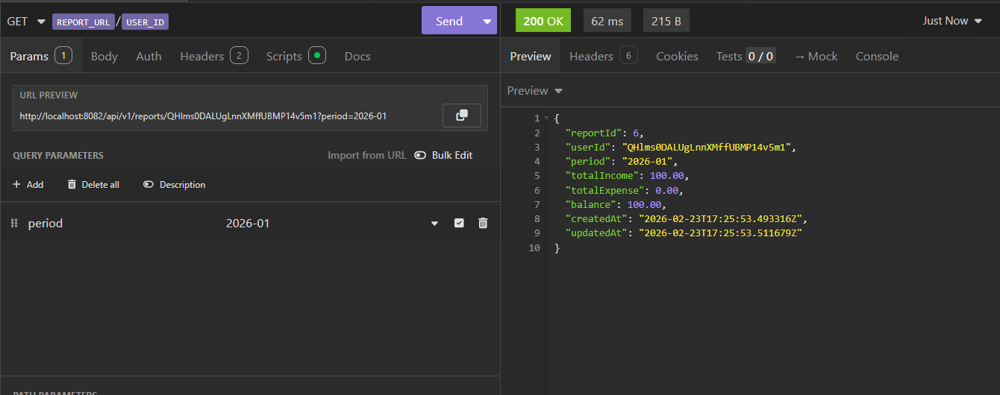

#### Test F-07.2 — POST recalculate y verificar que valores NO cambian

| Campo | Valor |
|---|---|
| **Method** | `POST` |
| **URL** | `http://localhost:8082/api/v1/reports/recalculate` |
| **Body** | `{"userId":"{userId}","period":"2026-01"}` |
| **Status** | `200 OK` |
| **Resultado** | `totalIncome`, `totalExpense` y `balance` son identicos al paso anterior. Solo cambia `updatedAt`. |

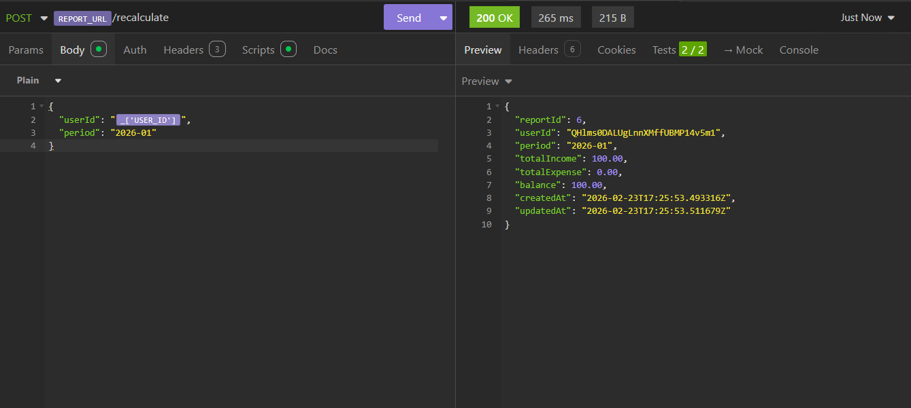

---

### 7.7 F-11 — Generic error message without resource ID

#### Test F-11.1 — GET transaction inexistente

| Campo | Valor |
|---|---|
| **Method** | `GET` |
| **URL** | `http://localhost:8081/api/v1/transactions/12345` |
| **Status** | `404 NOT FOUND` |
| **Mensaje esperado** | `"Transaction not found with id: 12345"` |
| **Mensaje actual** | `"Transaction not found"` (sin ID) |

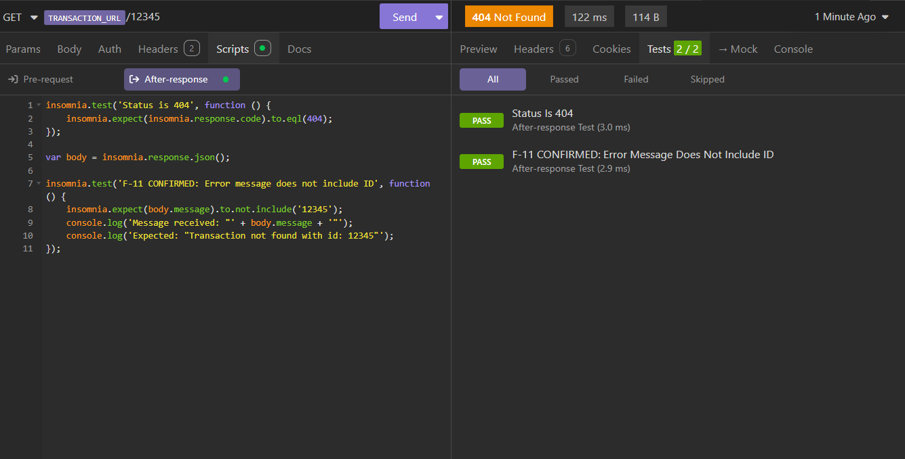

## Appendix A: Event Flow Diagram

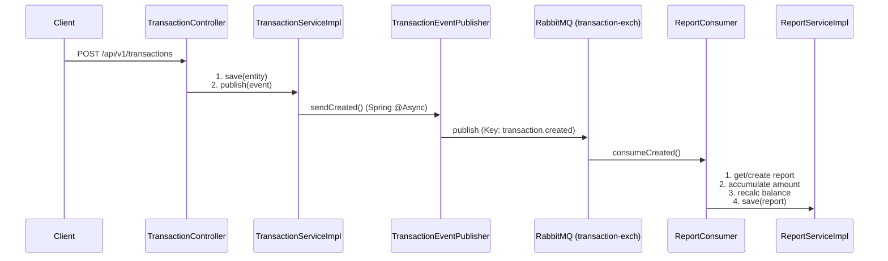

## Appendix B: Infrastructure Topology

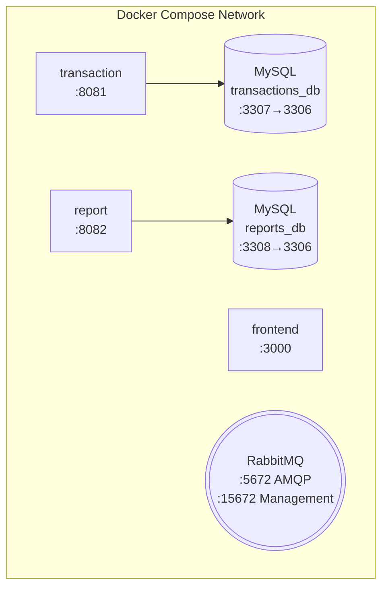

## Appendix C: Technology Stack

| Component | Technology | Version |
|---|---|---|
| Framework | Spring Boot | 4.0.2 |
| Language | Java | 17 |
| ORM | Hibernate / Spring Data JPA | — |
| Message Broker | RabbitMQ | 4.0 |
| Database | MySQL | 8.0 |
| Validation | Jakarta Bean Validation | — |
| PDF Generation | Apache PDFBox | 3.0.4 |
| Build Tool | Maven | — |
| Containerization | Docker + Docker Compose | — |
| Frontend Auth | Firebase Authentication | — |

## 8. Compliance Summary

| ID | Severity | Status | Owner |
|---|---|---|---|
| F-01 | Medium | Open | ARCH |
| F-02 | Medium | Open | DEV |
| F-03 | High | Open | ARCH |
| F-04 | High | Open | DEV |
| F-05 | Medium | Open | DEV |
| F-06 | Low | Open | ARCH |
| F-07 | Low | Open | DEV |
| F-08 | Medium | Open | DEV |
| F-09 | Medium | Open | DEV |
| F-10 | Low | Open | DEV |
| F-11 | Low | Open | DEV |
| F-12 | Low | Open | ARCH |
| F-13 | Low | Open | DEV |

The API maturity assessment reveals a transitionary system with functional baseline capabilities but lacking robust security, validation, and fully idempotent operations. Addressing the identified high and medium severity findings will be crucial before considering the services production-ready and fully REST-compliant.
