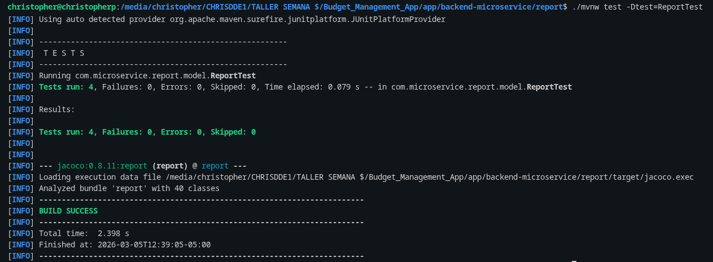
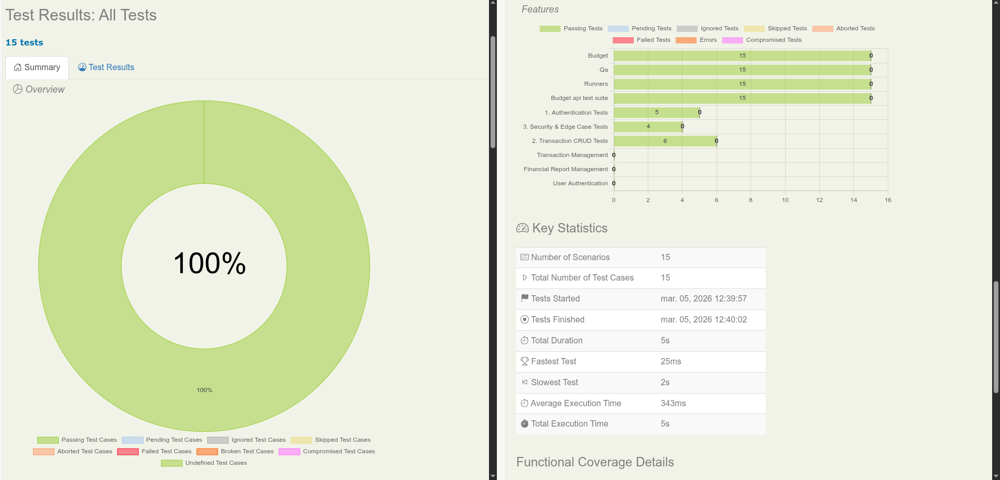
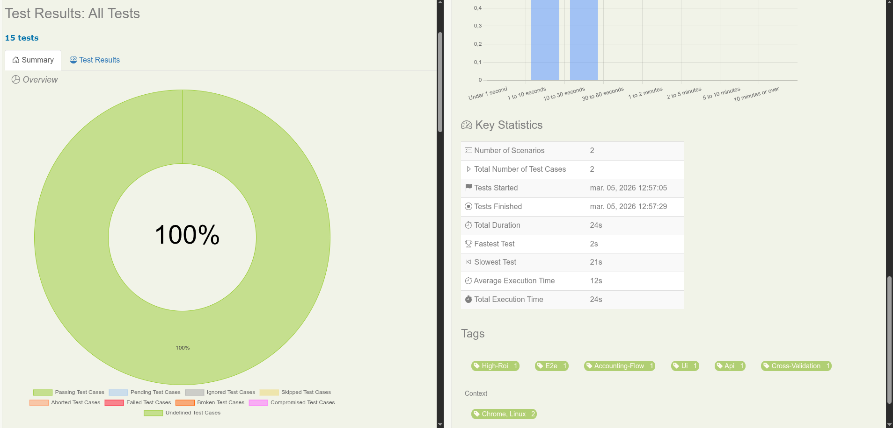

# 📊 Budget Management App - Estrategia de Automatización QA

## 👥 Equipo
- **Christopher Pallo**
- **Hans Ortiz**
- **Cristian Renz**

## 🎯 Razón de Ser y el Concepto de ROI

Este proyecto trasciende la ejecución tradicional de casos de prueba; su propósito central es demostrar empíricamente el valor de la **Pirámide de Pruebas** y refutar categóricamente el **"Antipatrón del Cono de Helado"** (Ice Cream Cone Antipattern).

### El Caso de Estudio: Trazabilidad Vertical
Hemos tomado un flujo crítico de negocio idéntico y lo hemos atravesado por las 3 capas fundamentales de la pirámide:
**`Ingreso de $2000 - Gasto de $500 = Balance de $1500`**

### Destrucción vs. Maximización del ROI
El antipatrón del cono de helado sugiere automatizar masivamente a través de la Interfaz de Usuario (UI). Sin embargo, la automatización UI destruye el ROI corporativo debido a:
- **Costos de Mantenimiento:** Alta volatilidad y fragilidad ante mínimos cambios visuales (flakiness).
- **Tiempos Muertos (Ciclo de Retroalimentación):** Tiempos de ejecución exponencialmente más lentos, bloqueando los pipelines de CI/CD.

La verdadera estrategia de un **Arquitecto SDET** radica en **empujar el descubrimiento de bugs hacia la base del código fuente (Unitario/API)**. En las capas inferiores, arreglar un defecto cuesta fracciones de centavo, su ejecución toma escasos milisegundos y su mantenimiento es ínfimo, maximizando exponencialmente el Retorno de Inversión y asegurando una entrega continua de calidad real.

## ⚙️ Pila Tecnológica

### Pila de QA, Backend y Automatización
[](https://www.java.com/)
[](https://spring.io/)
[](https://maven.apache.org/)
[](https://gradle.org/)
[](https://www.selenium.dev/)

### Infraestructura y Mensajería
[](https://www.docker.com/)
[](https://www.rabbitmq.com/)
[](https://www.postgresql.org/)

### Versiones Específicas

| Framework / Herramienta | Versión | Ecosistema asociado |
| :--- | :--- | :--- |
| **Java** | 17 | Lenguaje Base |
| **Gradle** | 8.5 | Compilador Automatización QA |
| **Maven** | 3.x | Compilador Microservicio (Unit) |
| **Serenity BDD** | 4.2.6 | QA Framework (UI & API) |
| **JUnit** | 5.11.1 | Motor de pruebas (Unit & QA) |
| **REST Assured** | 5.5.0 | Testing de Contratos (API) |
| **Selenium WebDriver** | 4.25.0 | Interacción E2E (UI) |

## 📈 Analítica de ROI (La Pirámide)

| Capa | Tecnología | Tiempo de Ejecución | Análisis Empírico de ROI |
| :--- | :--- | :--- | :--- |
| **Unitario (Base)** | JUnit 5 puro | **~7 milisegundos** | Validamos la matemática pura del dominio. ROI Altísimo. |
| **API (Medio)** | Serenity REST | **~4 segundos** | Validamos la integración, Base de Datos y eventos asíncronos de RabbitMQ. ROI Alto. |
| **UI (Punta)** | Serenity Screenplay | **~28 segundos** | Validamos la experiencia gráfica E2E. ROI Bajo (costoso y lento). |

## 🤖 Flujo de Trabajo AI — Estrategia QA

Apoyados en la filosofía de trabajo **AI-First**, nuestra arquitectura de aseguramiento de calidad distribuye las responsabilidades maximizando la eficiencia:

- **Humanos = Arquitectos de Estrategia SDET:** Diseñamos la arquitectura transversal, definimos el cálculo de ROI, garantizamos la Trazabilidad vertical y tomamos decisiones de diseño estructural de alto nivel y el impacto en el negocio.
- **IA = Ejecutor de código boilerplate (SDET Junior):** La inteligencia artificial asume el rol del andamiaje mecánico, auto-generando el código repetitivo de Screenplay, configuraciones iniciales transversales y parametrizaciones básicas.

***

## 🚀 Ejecución 

La arquitectura se compone de los Microservicios (Auth, Transaction, Report), el Frontend, RabbitMQ y PostgreSQL. A continuación, detallamos paso a paso la configuración de la infraestructura y el método para evaluar nuestro caso de estudio transversal a través de las 3 capas constructivas.

### Pre-requisitos
Para un correcto ensamble local de toda la plataforma web, el entorno anfitrión debe certificar los siguientes requerimientos:
- **Docker & Docker Compose** configurados y activos.
- **Java 17** (JDK) estandarizado a nivel de variables de entorno.
- Puertos cruciales liberados en la máquina:
  - `5432` (PostgreSQL de la plataforma).
  - `5672`, `15672` (Comunicación y panel de RabbitMQ).
  - `8082` (Microservicio autónomo de Report Service).
  - Puertos de Auth y Transaction Service (`8084`, `8085`, etc...).

### Configuración del Docker Compose
Dirígete a la raíz del repositorio y levanta todos los componentes centrales encapsulados de backend, frontend y bases de datos transaccionales, utilizando ejecución *detached* en segundo plano.

```bash
cd /ruta/absoluta/Budget_Management_App/
docker-compose up -d
```
> **Nota de Arquitectura:** Esta orden inicializará la topología completa. Desplegando RabbitMQ para intercambio de mensajes AMQP, bases de datos en PostgreSQL para auditoría y persistencia, los microservicios backend de dominio lógico (Report, Transaction, Auth) y el Frontend.

---

### Probando el Flujo (Paso a Paso)

#### Paso 1: Pruebas Unitarias (Lógica Pura)
Entra a la capa de dominio profunda, un entorno completamente aislado de la base de datos o integraciones.

1. **Ingresa al microservicio correspondiente:**
```bash
cd app/backend-microservice/report
```
2. **Ejecuta al compilador nativo (Maven) contra la clase constructiva base:**
```bash
mvn test -Dtest=ReportTest
```
*📍 Verificación:* Revisa el *log* en consola. La salida final confirmará un desempeño menor a 1 segundo (< `1s`) dado que está probando netamente el núcleo lógico matemático.

#### Paso 2: Pruebas de API (Integración)
Validamos un paso arriba, donde los microservicios, bases de datos relacionales locales (PostgreSQL) y el bróker de colas (RabbitMQ) interactúan entre sí.

1. **Retorna al nivel del proyecto de Automatización:**
```bash
cd ../../../qa-automation
```
2. **Invoca la capa media con el orquestador (Gradle):**
```bash
./gradlew testApi
```
*📍 Verificación:* Se comprobará la escritura exitosa a la DB y el manejo correcto del bus de eventos (RabbitMQ). Puedes abrir en tu explorador la carpeta física generada para auditar el HTML de Serenity: `target/site/serenity/api/index.html`.

#### Paso 3: Pruebas UI (End-to-End)
Coronando la pirámide, se comprobará visualmente el flujo final en un navegador renderizado, a costa de perder la eficiencia temporal y ganar volatilidad en los selectores HTML.

1. **Sin salir del nivel de QA Automation, invoca la tarea final:**
```bash
./gradlew testUi
```
> **⚠️ PRECAUCIÓN DE FLAKINESS / INESTABILIDAD VISUAL:** El script levantará una instancia automatizada de *Chrome local*. Por favor **NO TOCAR el mouse ni realizar clicks fuera de la ventana en enfoque**, hacerlo va a alterar la jerarquía del DOM y corromperá la prueba (causando un fallo o flakiness).

*📍 Verificación:* Tras \~28 segundos, revisa el reporte fotográfico capturado paso a paso en: `target/site/serenity/ui/index.html`.

---

## 📸 Recursos y Evidencias
Todos nuestros diagramas, matrices estructurales arquitectónicas y los reportes finales automatizados en HTML de Serenity residen en `/assets/`.

**Unitario (Base de Dominio):**  


**API (Contratos e Integración):**  


**UI (Presentación End-to-End):**  


## ⚖️ Licencia
Proprietary — Internal Use Sofka.
